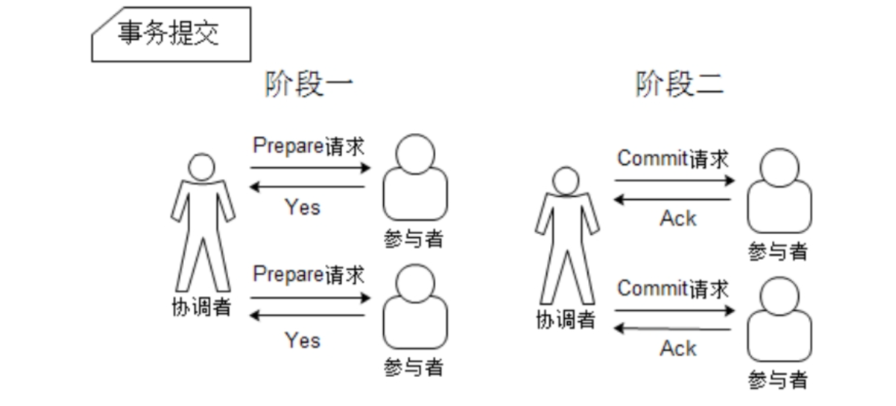
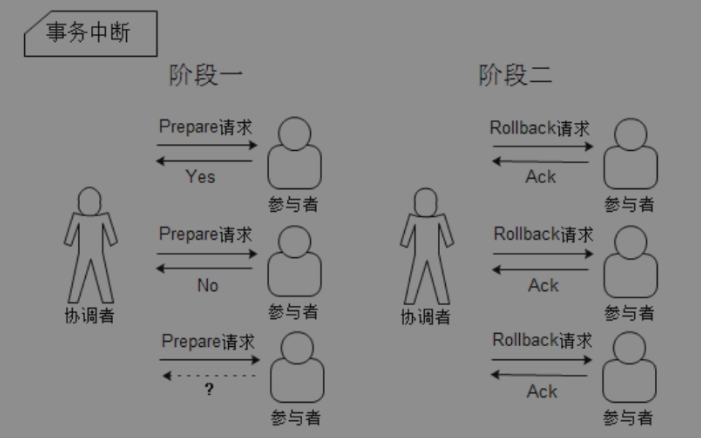

# 分布式事务

分布式系统中为了保证全局数据的一致性，会使用分布式事务来确保一次操作要么失败，要么成功。

为了实现分布式事务的全局控制，一般有两阶段提交和三阶段提交的方法。

在分布式事务中通常包含一个协调者和多个参与者，协调者负责协调各个参与者之间的事务执行，尽量确保各个参与者的数据保持一致。

## 两阶段提交

两阶段提交从名字上就可以得出，它是分为两个阶段执行的：

1. 请求阶段
   * 协调者向多个参与者发送请求
   * 参与者收到请求后，执行事务操作并记录undo日志和redo日志
   * 参与者执行完毕后，发送yes给协调者
2. 提交阶段
   * 协调者收到了所有参与者的yes，那么协调者会向所有的参与者发送提交
   * 参与者收到提交后，会提交自己的事务
   * 参与者提交完成，向协调者发送ack
   * 协调者收到所有参与者的ack后，完成事务

中断事务的情况

假设第一步请求中有任何一个参与者返回no，或者等待超时，那么就会中断事务

1. 协调者发送rollback给所有参与者
2. 参与者收到rollback请求后，会利用undo日志回滚，并在回滚后释放在整个事务执行期间占用的资源
3. 参与者会发送ack消息给协调者
4. 协调者收到所有参与者的ack后，中断事务

优点：原理简单、实现方便

缺点：

* 单点问题：如果协调者失效，那么可能会导致无法提交，而且其他参与者可能会一直处于锁定状态
* 数据不一致：如果协调者发送了一部分commit，但是没有给另一部分参与者发送commit，就会导致各个服务之间数据不一致
* 同步阻塞：在二阶段中，各个参与者都要等待其他参与者都响应才能完成或中断事务

## 三阶段提交

三阶段提交分为三步：

1. canCommit

   协调者发送请求给参与者，确保参与者能够执行事务，如果参与者返回yes则表示能够执行事务。

2. preCommit

   * 协调者向所有参与者发送preCommit的请求，进入Prepared阶段
   * 参与者执行事务，记录undo和redo日志
   * 参与者向协调者发送ack信息，同时等待最终的指令：提交或中断

   如果这一步有一个参与者的反馈是No，那么

   * 协调者会向参与者发送abort请求
   * 无论是收到abort请求，或是在等待协调者请求超时，参与者都会中断事务

3. doCommit

   * 协调者收到所有参与者的ack响应后，向所有参与者发送doCommit请求
   * 参与者执行commit，执行完后释放占用的资源
   * 参与者在完成事务之后，向协调者发送ack消息
   * 协调者收到所有的ack消息后，事务完成

   中断事务

   如果任何一个参与者返回了no，或者在等待超时之后，那么协调者就会中断事务。

   * 协调者向所有的参与者发送abort请求
   * 参与者利用undo日志回滚，回滚完后释放资源
   * 参与者向协调者发送ack消息
   * 协调者接受到所有参与者返回的ack消息后，中断事务

一旦进入阶段三，可能会出现两种故障：

1. 协调者故障
2. 协调者和参与者之间的网络故障

无论是上面哪种情况，参与者都会在等待超时之后继续提交事务。

不过，如果在阶段二中，参与者收到preCommit消息后，如果网络出现分区，协调者和参与者无法正常通信，这种情况下，该参与者依然会提交事务，而其他参与者会受到abort，然后进行回滚。所以这样必然会导致数据的不一致性。