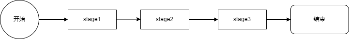

# Pipline模式

## 概述



Pipline模式是一种线性模式，一个Pipline只有一个输入和一个输出，中间包含多个stage，每个stage也都只有一个输入和一个输出，stage会处理输入的数据并将结果传给下一个stage。

Pipline模式的使用场景有：

* 数据预处理。通常，数据预处理包括数据清洗、异常数据处理、标准化处理、独热码处理等，数据需要按照一定的步骤被处理。
* 构建DevOps流程。开发的流程通常包括需求评估、系统设计、开发、测试、预部署等步骤，使用Pipline模式可以构建完成的开发流程，提高开发的进度和质量。

## 实例

### Function

```java
package java.util.function;

import java.util.Objects;

@FunctionalInterface
public interface Function<T, R> {....}
```

`cglib`中的`Function`接口，输入一个值，经过处理后输出一个值。

简单测试

```java
import java.util.function.Function;

import org.junit.jupiter.api.Test;

public class TestController {

    @Test
    public void testPipline() {
        String a = "1234";
        change(a, (String x) -> {
            return Integer.parseInt(x);
        });
    }

    public void change(String s, Function<String, Integer> func) {
        Integer num = func.apply(s);
        System.out.println("This is num:" + num); //1234
        System.out.println("num is Integer type?" + (num instanceof Integer)); //true
    }
}
```

### java Lamda

lamda也使用Pipline模式，可以对数据进行处理，并将结果传入下一个处理方法。

```java
List<Integer> list = Arrays.asList(1, 2, 3, 4, 8, 9, 19, 15, 17, 11);
List<Integer> collect = list.stream()
        .filter(x -> x > 4)
        .sorted((x, y) -> x.compareTo(y))
        .collect(Collectors.toList());
System.out.println(Arrays.deepToString(collect.toArray()));
//[8, 9, 11, 15, 17, 19]
```

上面的代码先筛选了大于4的数，然后将数字排序了。

## 应用

当业务流程呈现线性结构时，使用Pipline模式是合适的。而如果需要根据条件选择不同的处理方法时，选择责任链模式更合适。因为责任链模式是一个接口有多种不同的实现。

Pipline模式纵然有很强的灵活性，但是也存在一定的缺点：

* 当需要测试一个Pipline时，其中一个stage的测试需要其他stage配合
* Pipline模式的配置通常会存在数据库或其他位置

