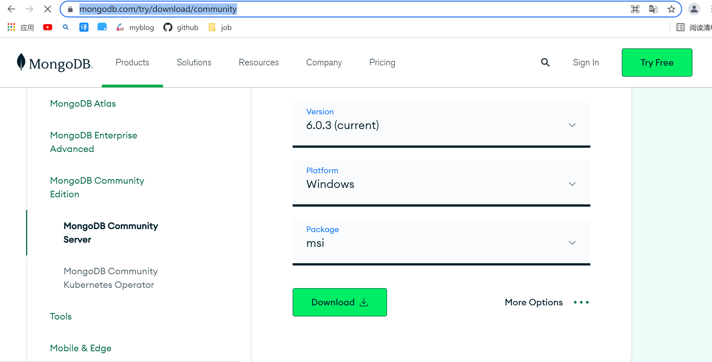
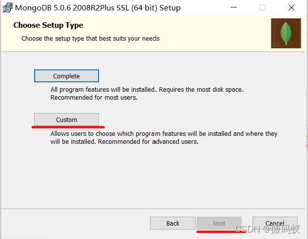
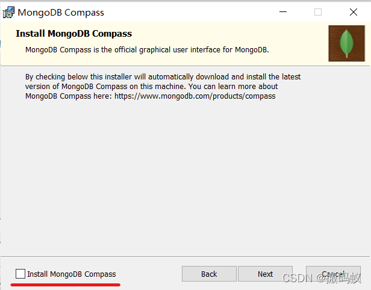
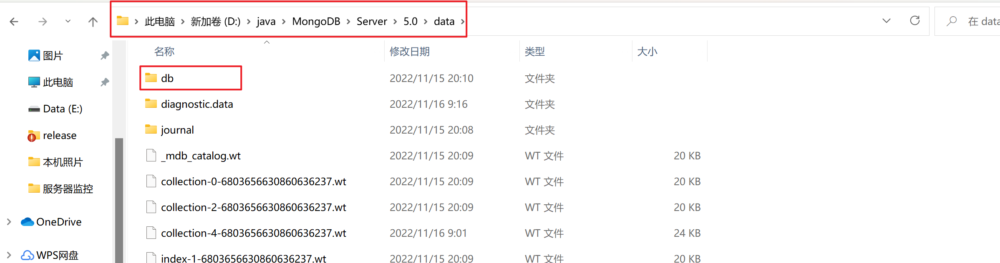
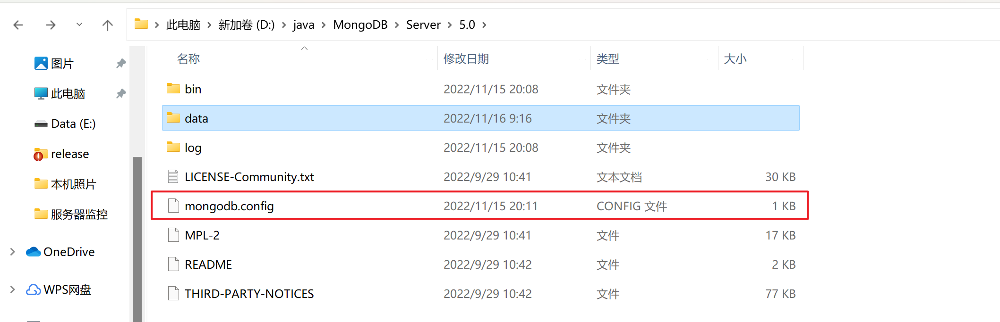
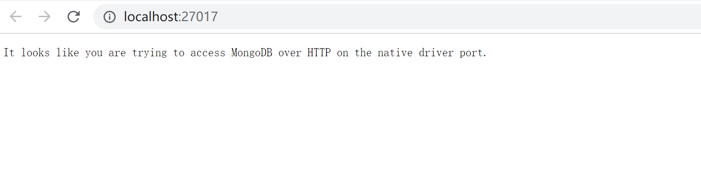
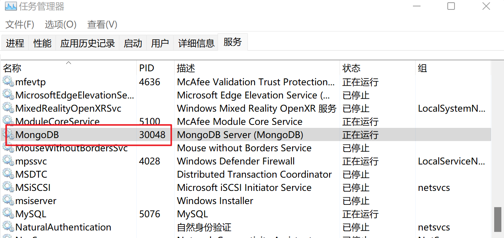
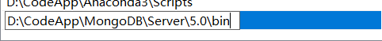
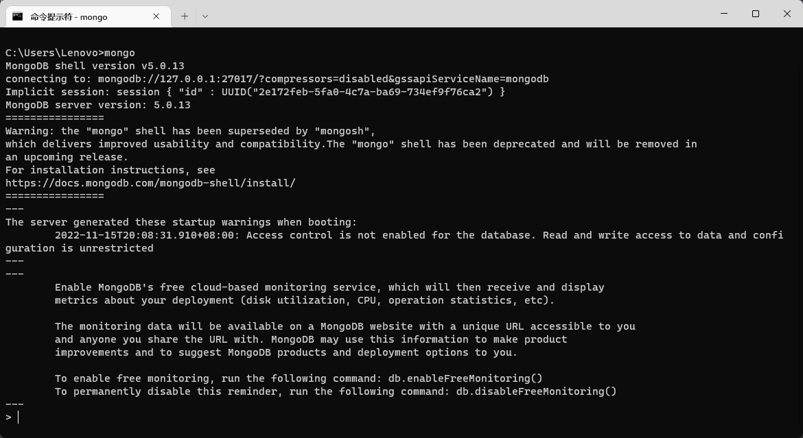

# 下载

地址：https://www.mongodb.com/try/download/community



# 安装



选择Complete，表示安装到默认路径（不推荐）
**选择Custom**，表示自定义安装路径（推荐）



**这个对号取消掉**，这是个可视化工具。

注意，我们需要在data目录下新建一个db文件夹。




# 配置

在MongoDB的安装路径下创建mongodb.config。



```config
dbpath=D:\java\MongoDB\Server\5.0\data\db #数据库路径

logpath=D:\java\MongoDB\Server\5.0\log\mongod.log #日志输出文件路径

logappend=true#错误日志采用追加模式

journal=true#启用日志文件，默认启用

quiet=true #过滤掉无用的日志信息，若需要调试使用请设置为false

port=27017 #端口号 默认为27017

```

# 启动

cmd窗口的`D:\java\MongoDB\Server\5.0\bin`目录下输入：

```
mongod --dbpath "mongodbdatadb"  --logpath "mongodblogslog"  --install -serviceName "MongoDB"  
```

mongodbdatadb指的是db文件夹的路径，例如我的地址是：`D:\java\MongoDB\Server\5.0\data\db`

mongodblogslog指的是mongo日志文件的路径，例如我的地址是：`D:\java\MongoDB\Server\5.0\log\mongod.log`

或者用配置文件启动
```
mongod --config "D:\java\MongoDB\Server\5.0\mongodb.config" --install --serviceName "MongoDB"
```
打开浏览器访问 [http://localhost:27017](http://localhost:27017/)
出现如下页面，则表示启动成功。



在服务中已出现MongoDB服务已经启动，正在运行。



# 添加环境变量

添加你的MongoDB的bin目录的路径即可。



cmd测试

到此，就成功了！！！

# 可视化工具

官网有可视化工具，但是使用DataGrip也不错。

