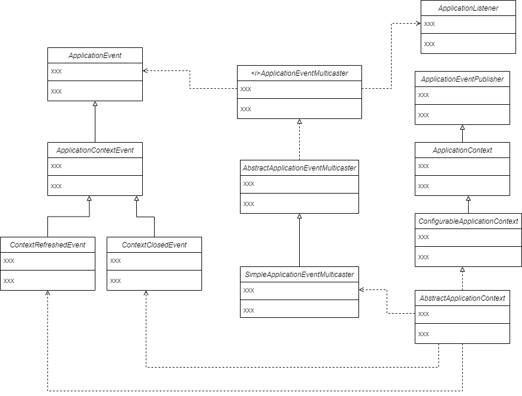

# Spring事件

## Spring事件逻辑

**创建事件类**

1. 创建ApplicationEvent类继承EventObject类
2. 创建ApplicationContextEvent实现ApplicationEvent类，这个类中增加ApplicationContext的获取方法
3. 创建ContextRefreshedEvent类来刷新，创建ContextClosedEvent类来关闭

**创建事件监听类**

1. 创建ApplicationListener接口继承EventListener类，这个类是一个ApplicationEvent的泛型类，包含一个方法onApplicationEvent在监听成功后执行操作

**创建事件发布相关类**

1. 创建一个ApplicationEventMulticaster接口，定义事件监听器的新增和删除、执行多个事件
2. 创建AbstractApplicationEventMulticaster实现ApplicationEventMulticaster接口，除了实现接口还需要新增一个获取处理对应ApplicationEvent的所有事件监听器的方法：getApplicationListeners
3. 创建SimpleApplicationEventMulticaster实现multicastEvent方法

**在容器中初始化事件发布者、注册事件监听者、发布容器刷新完成事件**

 

**测试流程**

1. 创建一个自定义事件继承ApplicationContextEvent

2. 创建一个自定义监听器实现ApplicationListener接口，定义在事件被监听到后要执行什么操作

 

**执行流程**

容器启动后会注册事件发布者、注册事件监听器、发布容器刷新完成事件，之后就可以调用AbstractApplicationContext的publishEvent方法，发布事件。

## 对象关系图

## 复习与自测

### 概述

Spring事件监听器是什么？

Spring事件监听器由三部分组成

1. 事件：ApplicationEvent，继承自JDK的EventObject，事件是一个被观察者。
2. 事件发布者:ApplicationEventMulticaster。事件发布者负责发布事件
3. 事件监听者：ApplicationListener，继承自EventListener。 负责监听对应类型的事件。

ApplicationEvent有四个默认的事件：

* ContextRefreshedEvent：ApplicationContext初始化或刷新完成后触发的事件。
* ContextClosedEvent：ApplicationContext关闭时触发的事件。
* ContextStartedEvent：ApplicationContext启动后触发的事件。
* ContextStartedEvent：ApplicationContext停止后触发的事件。

### 问答

Spring事件的应用场景是什么？

答：和主业务无关的操作都可以通过事件来解耦

* 报警。例如异常报警。
* 关键性日志记录和业务埋点。例如记录操作日志。
* 性能监控。例如说一些接口的时长，性能方便的埋点等。可以通过事件机制进行解耦。

### 设计模式

#### 观察者模式

观察者模式是一种行为模式，它定义了一种一对多的关系。观察者模式包含两个概念：主题和观察者。主题是有状态的，当主题的状态改变后，所有观察者会受到通知并自动更新。

