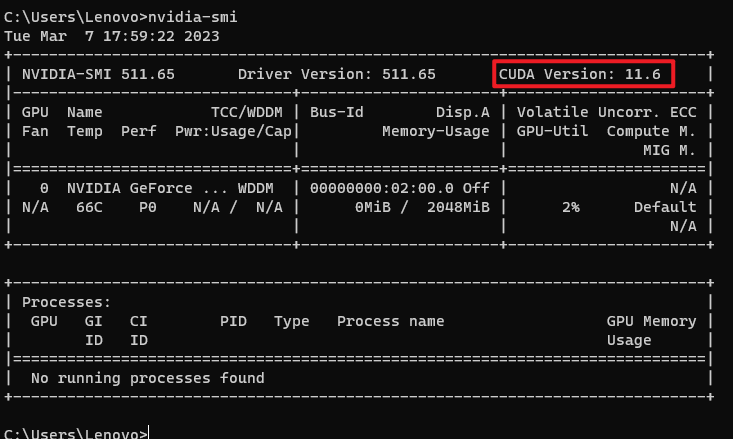
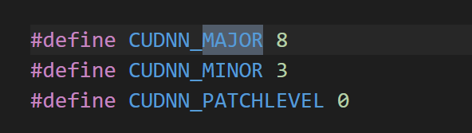

# Tensorflow-cuda-cudNN
tensorflow、cuda和cudNN的版本是有对应关系的，所以一定要按照版本关系来安装。否则可能代码会无法运行。

Windows版本对应关系地址：https://tensorflow.google.cn/install/source_windows

cuDNN下载地址：hhttps://developer.nvidia.com/rdp/cudnn-archive

cuda下载地址：https://developer.nvidia.com/cuda-toolkit-archive

10.0版本cuda下载地址：[https://developer.nvidia.com/cuda-10.0-download-archive?target_os=Windows&target_arch=x86_64&target_version=10&target_type=exenetwork](https://developer.nvidia.com/cuda-10.0-download-archive?target_os=Windows&target_arch=x86_64&target_version=10&target_type=exenetwork)


## Windows

### CPU

| 版本              | Python 版本 | 编译器             | 构建工具            |
| :---------------- | :---------- | :----------------- | :------------------ |
| tensorflow-2.6.0  | 3.6-3.9     | MSVC 2019          | Bazel 3.7.2         |
| tensorflow-2.5.0  | 3.6-3.9     | MSVC 2019          | Bazel 3.7.2         |
| tensorflow-2.4.0  | 3.6-3.8     | MSVC 2019          | Bazel 3.1.0         |
| tensorflow-2.3.0  | 3.5-3.8     | MSVC 2019          | Bazel 3.1.0         |
| tensorflow-2.2.0  | 3.5-3.8     | MSVC 2019          | Bazel 2.0.0         |
| tensorflow-2.1.0  | 3.5-3.7     | MSVC 2019          | Bazel 0.27.1-0.29.1 |
| tensorflow-2.0.0  | 3.5-3.7     | MSVC 2017          | Bazel 0.26.1        |
| tensorflow-1.15.0 | 3.5-3.7     | MSVC 2017          | Bazel 0.26.1        |
| tensorflow-1.14.0 | 3.5-3.7     | MSVC 2017          | Bazel 0.24.1-0.25.2 |
| tensorflow-1.13.0 | 3.5-3.7     | MSVC 2015 update 3 | Bazel 0.19.0-0.21.0 |
| tensorflow-1.12.0 | 3.5-3.6     | MSVC 2015 update 3 | Bazel 0.15.0        |
| tensorflow-1.11.0 | 3.5-3.6     | MSVC 2015 update 3 | Bazel 0.15.0        |
| tensorflow-1.10.0 | 3.5-3.6     | MSVC 2015 update 3 | Cmake v3.6.3        |
| tensorflow-1.9.0  | 3.5-3.6     | MSVC 2015 update 3 | Cmake v3.6.3        |
| tensorflow-1.8.0  | 3.5-3.6     | MSVC 2015 update 3 | Cmake v3.6.3        |
| tensorflow-1.7.0  | 3.5-3.6     | MSVC 2015 update 3 | Cmake v3.6.3        |
| tensorflow-1.6.0  | 3.5-3.6     | MSVC 2015 update 3 | Cmake v3.6.3        |
| tensorflow-1.5.0  | 3.5-3.6     | MSVC 2015 update 3 | Cmake v3.6.3        |
| tensorflow-1.4.0  | 3.5-3.6     | MSVC 2015 update 3 | Cmake v3.6.3        |
| tensorflow-1.3.0  | 3.5-3.6     | MSVC 2015 update 3 | Cmake v3.6.3        |
| tensorflow-1.2.0  | 3.5-3.6     | MSVC 2015 update 3 | Cmake v3.6.3        |
| tensorflow-1.1.0  | 3.5         | MSVC 2015 update 3 | Cmake v3.6.3        |
| tensorflow-1.0.0  | 3.5         | MSVC 2015 update 3 | Cmake v3.6.3        |

### GPU

| 版本                  | Python 版本 | 编译器             | 构建工具            | cuDNN | CUDA |
| :-------------------- | :---------- | :----------------- | :------------------ | :---- | :--- |
| tensorflow_gpu-2.6.0  | 3.6-3.9     | MSVC 2019          | Bazel 3.7.2         | 8.1   | 11.2 |
| tensorflow_gpu-2.5.0  | 3.6-3.9     | MSVC 2019          | Bazel 3.7.2         | 8.1   | 11.2 |
| tensorflow_gpu-2.4.0  | 3.6-3.8     | MSVC 2019          | Bazel 3.1.0         | 8.0   | 11.0 |
| tensorflow_gpu-2.3.0  | 3.5-3.8     | MSVC 2019          | Bazel 3.1.0         | 7.6   | 10.1 |
| tensorflow_gpu-2.2.0  | 3.5-3.8     | MSVC 2019          | Bazel 2.0.0         | 7.6   | 10.1 |
| tensorflow_gpu-2.1.0  | 3.5-3.7     | MSVC 2019          | Bazel 0.27.1-0.29.1 | 7.6   | 10.1 |
| tensorflow_gpu-2.0.0  | 3.5-3.7     | MSVC 2017          | Bazel 0.26.1        | 7.4   | 10   |
| tensorflow_gpu-1.15.0 | 3.5-3.7     | MSVC 2017          | Bazel 0.26.1        | 7.4   | 10   |
| tensorflow_gpu-1.14.0 | 3.5-3.7     | MSVC 2017          | Bazel 0.24.1-0.25.2 | 7.4   | 10   |
| tensorflow_gpu-1.13.0 | 3.5-3.7     | MSVC 2015 update 3 | Bazel 0.19.0-0.21.0 | 7.4   | 10   |
| tensorflow_gpu-1.12.0 | 3.5-3.6     | MSVC 2015 update 3 | Bazel 0.15.0        | 7.2   | 9.0  |
| tensorflow_gpu-1.11.0 | 3.5-3.6     | MSVC 2015 update 3 | Bazel 0.15.0        | 7     | 9    |
| tensorflow_gpu-1.10.0 | 3.5-3.6     | MSVC 2015 update 3 | Cmake v3.6.3        | 7     | 9    |
| tensorflow_gpu-1.9.0  | 3.5-3.6     | MSVC 2015 update 3 | Cmake v3.6.3        | 7     | 9    |
| tensorflow_gpu-1.8.0  | 3.5-3.6     | MSVC 2015 update 3 | Cmake v3.6.3        | 7     | 9    |
| tensorflow_gpu-1.7.0  | 3.5-3.6     | MSVC 2015 update 3 | Cmake v3.6.3        | 7     | 9    |
| tensorflow_gpu-1.6.0  | 3.5-3.6     | MSVC 2015 update 3 | Cmake v3.6.3        | 7     | 9    |
| tensorflow_gpu-1.5.0  | 3.5-3.6     | MSVC 2015 update 3 | Cmake v3.6.3        | 7     | 9    |
| tensorflow_gpu-1.4.0  | 3.5-3.6     | MSVC 2015 update 3 | Cmake v3.6.3        | 6     | 8    |
| tensorflow_gpu-1.3.0  | 3.5-3.6     | MSVC 2015 update 3 | Cmake v3.6.3        | 6     | 8    |
| tensorflow_gpu-1.2.0  | 3.5-3.6     | MSVC 2015 update 3 | Cmake v3.6.3        | 5.1   | 8    |
| tensorflow_gpu-1.1.0  | 3.5         | MSVC 2015 update 3 | Cmake v3.6.3        | 5.1   | 8    |
| tensorflow_gpu-1.0.0  | 3.5         | MSVC 2015 update 3 | Cmake v3.6.3        | 5.1   | 8    |

## Linux

### CPU

| 版本              | Python 版本  | 编译器    | 构建工具     |
| :---------------- | :----------- | :-------- | :----------- |
| tensorflow-2.6.0  | 3.6-3.9      | GCC 7.3.1 | Bazel 3.7.2  |
| tensorflow-2.5.0  | 3.6-3.9      | GCC 7.3.1 | Bazel 3.7.2  |
| tensorflow-2.4.0  | 3.6-3.8      | GCC 7.3.1 | Bazel 3.1.0  |
| tensorflow-2.3.0  | 3.5-3.8      | GCC 7.3.1 | Bazel 3.1.0  |
| tensorflow-2.2.0  | 3.5-3.8      | GCC 7.3.1 | Bazel 2.0.0  |
| tensorflow-2.1.0  | 2.7、3.5-3.7 | GCC 7.3.1 | Bazel 0.27.1 |
| tensorflow-2.0.0  | 2.7、3.3-3.7 | GCC 7.3.1 | Bazel 0.26.1 |
| tensorflow-1.15.0 | 2.7、3.3-3.7 | GCC 7.3.1 | Bazel 0.26.1 |
| tensorflow-1.14.0 | 2.7、3.3-3.7 | GCC 4.8   | Bazel 0.24.1 |
| tensorflow-1.13.1 | 2.7、3.3-3.7 | GCC 4.8   | Bazel 0.19.2 |
| tensorflow-1.12.0 | 2.7、3.3-3.6 | GCC 4.8   | Bazel 0.15.0 |
| tensorflow-1.11.0 | 2.7、3.3-3.6 | GCC 4.8   | Bazel 0.15.0 |
| tensorflow-1.10.0 | 2.7、3.3-3.6 | GCC 4.8   | Bazel 0.15.0 |
| tensorflow-1.9.0  | 2.7、3.3-3.6 | GCC 4.8   | Bazel 0.11.0 |
| tensorflow-1.8.0  | 2.7、3.3-3.6 | GCC 4.8   | Bazel 0.10.0 |
| tensorflow-1.7.0  | 2.7、3.3-3.6 | GCC 4.8   | Bazel 0.10.0 |
| tensorflow-1.6.0  | 2.7、3.3-3.6 | GCC 4.8   | Bazel 0.9.0  |
| tensorflow-1.5.0  | 2.7、3.3-3.6 | GCC 4.8   | Bazel 0.8.0  |
| tensorflow-1.4.0  | 2.7、3.3-3.6 | GCC 4.8   | Bazel 0.5.4  |
| tensorflow-1.3.0  | 2.7、3.3-3.6 | GCC 4.8   | Bazel 0.4.5  |
| tensorflow-1.2.0  | 2.7、3.3-3.6 | GCC 4.8   | Bazel 0.4.5  |
| tensorflow-1.1.0  | 2.7、3.3-3.6 | GCC 4.8   | Bazel 0.4.2  |
| tensorflow-1.0.0  | 2.7、3.3-3.6 | GCC 4.8   | Bazel 0.4.2  |

### GPU

| 版本                  | Python 版本  | 编译器    | 构建工具     | cuDNN | CUDA |
| :-------------------- | :----------- | :-------- | :----------- | :---- | :--- |
| tensorflow-2.6.0      | 3.6-3.9      | GCC 7.3.1 | Bazel 3.7.2  | 8.1   | 11.2 |
| tensorflow-2.5.0      | 3.6-3.9      | GCC 7.3.1 | Bazel 3.7.2  | 8.1   | 11.2 |
| tensorflow-2.4.0      | 3.6-3.8      | GCC 7.3.1 | Bazel 3.1.0  | 8.0   | 11.0 |
| tensorflow-2.3.0      | 3.5-3.8      | GCC 7.3.1 | Bazel 3.1.0  | 7.6   | 10.1 |
| tensorflow-2.2.0      | 3.5-3.8      | GCC 7.3.1 | Bazel 2.0.0  | 7.6   | 10.1 |
| tensorflow-2.1.0      | 2.7、3.5-3.7 | GCC 7.3.1 | Bazel 0.27.1 | 7.6   | 10.1 |
| tensorflow-2.0.0      | 2.7、3.3-3.7 | GCC 7.3.1 | Bazel 0.26.1 | 7.4   | 10.0 |
| tensorflow_gpu-1.15.0 | 2.7、3.3-3.7 | GCC 7.3.1 | Bazel 0.26.1 | 7.4   | 10.0 |
| tensorflow_gpu-1.14.0 | 2.7、3.3-3.7 | GCC 4.8   | Bazel 0.24.1 | 7.4   | 10.0 |
| tensorflow_gpu-1.13.1 | 2.7、3.3-3.7 | GCC 4.8   | Bazel 0.19.2 | 7.4   | 10.0 |
| tensorflow_gpu-1.12.0 | 2.7、3.3-3.6 | GCC 4.8   | Bazel 0.15.0 | 7     | 9    |
| tensorflow_gpu-1.11.0 | 2.7、3.3-3.6 | GCC 4.8   | Bazel 0.15.0 | 7     | 9    |
| tensorflow_gpu-1.10.0 | 2.7、3.3-3.6 | GCC 4.8   | Bazel 0.15.0 | 7     | 9    |
| tensorflow_gpu-1.9.0  | 2.7、3.3-3.6 | GCC 4.8   | Bazel 0.11.0 | 7     | 9    |
| tensorflow_gpu-1.8.0  | 2.7、3.3-3.6 | GCC 4.8   | Bazel 0.10.0 | 7     | 9    |
| tensorflow_gpu-1.7.0  | 2.7、3.3-3.6 | GCC 4.8   | Bazel 0.9.0  | 7     | 9    |
| tensorflow_gpu-1.6.0  | 2.7、3.3-3.6 | GCC 4.8   | Bazel 0.9.0  | 7     | 9    |
| tensorflow_gpu-1.5.0  | 2.7、3.3-3.6 | GCC 4.8   | Bazel 0.8.0  | 7     | 9    |
| tensorflow_gpu-1.4.0  | 2.7、3.3-3.6 | GCC 4.8   | Bazel 0.5.4  | 6     | 8    |
| tensorflow_gpu-1.3.0  | 2.7、3.3-3.6 | GCC 4.8   | Bazel 0.4.5  | 6     | 8    |
| tensorflow_gpu-1.2.0  | 2.7、3.3-3.6 | GCC 4.8   | Bazel 0.4.5  | 5.1   | 8    |
| tensorflow_gpu-1.1.0  | 2.7、3.3-3.6 | GCC 4.8   | Bazel 0.4.2  | 5.1   | 8    |
| tensorflow_gpu-1.0.0  | 2.7、3.3-3.6 | GCC 4.8   | Bazel 0.4.2  | 5.1   | 8    |

## macOS

### CPU

| 版本              | Python 版本  | 编译器                 | 构建工具     |
| :---------------- | :----------- | :--------------------- | :----------- |
| tensorflow-2.6.0  | 3.6-3.9      | Xcode 10.11 中的 Clang | Bazel 3.7.2  |
| tensorflow-2.5.0  | 3.6-3.9      | Xcode 10.11 中的 Clang | Bazel 3.7.2  |
| tensorflow-2.4.0  | 3.6-3.8      | Xcode 10.3 中的 Clang  | Bazel 3.1.0  |
| tensorflow-2.3.0  | 3.5-3.8      | Xcode 10.1 中的 Clang  | Bazel 3.1.0  |
| tensorflow-2.2.0  | 3.5-3.8      | Xcode 10.1 中的 Clang  | Bazel 2.0.0  |
| tensorflow-2.1.0  | 2.7、3.5-3.7 | Xcode 10.1 中的 Clang  | Bazel 0.27.1 |
| tensorflow-2.0.0  | 2.7、3.5-3.7 | Xcode 10.1 中的 Clang  | Bazel 0.27.1 |
| tensorflow-2.0.0  | 2.7、3.3-3.7 | Xcode 10.1 中的 Clang  | Bazel 0.26.1 |
| tensorflow-1.15.0 | 2.7、3.3-3.7 | Xcode 10.1 中的 Clang  | Bazel 0.26.1 |
| tensorflow-1.14.0 | 2.7、3.3-3.7 | Xcode 中的 Clang       | Bazel 0.24.1 |
| tensorflow-1.13.1 | 2.7、3.3-3.7 | Xcode 中的 Clang       | Bazel 0.19.2 |
| tensorflow-1.12.0 | 2.7、3.3-3.6 | Xcode 中的 Clang       | Bazel 0.15.0 |
| tensorflow-1.11.0 | 2.7、3.3-3.6 | Xcode 中的 Clang       | Bazel 0.15.0 |
| tensorflow-1.10.0 | 2.7、3.3-3.6 | Xcode 中的 Clang       | Bazel 0.15.0 |
| tensorflow-1.9.0  | 2.7、3.3-3.6 | Xcode 中的 Clang       | Bazel 0.11.0 |
| tensorflow-1.8.0  | 2.7、3.3-3.6 | Xcode 中的 Clang       | Bazel 0.10.1 |
| tensorflow-1.7.0  | 2.7、3.3-3.6 | Xcode 中的 Clang       | Bazel 0.10.1 |
| tensorflow-1.6.0  | 2.7、3.3-3.6 | Xcode 中的 Clang       | Bazel 0.8.1  |
| tensorflow-1.5.0  | 2.7、3.3-3.6 | Xcode 中的 Clang       | Bazel 0.8.1  |
| tensorflow-1.4.0  | 2.7、3.3-3.6 | Xcode 中的 Clang       | Bazel 0.5.4  |
| tensorflow-1.3.0  | 2.7、3.3-3.6 | Xcode 中的 Clang       | Bazel 0.4.5  |
| tensorflow-1.2.0  | 2.7、3.3-3.6 | Xcode 中的 Clang       | Bazel 0.4.5  |
| tensorflow-1.1.0  | 2.7、3.3-3.6 | Xcode 中的 Clang       | Bazel 0.4.2  |
| tensorflow-1.0.0  | 2.7、3.3-3.6 | Xcode 中的 Clang       | Bazel 0.4.2  |

### GPU

| 版本                 | Python 版本  | 编译器           | 构建工具    | cuDNN | CUDA |
| :------------------- | :----------- | :--------------- | :---------- | :---- | :--- |
| tensorflow_gpu-1.1.0 | 2.7、3.3-3.6 | Xcode 中的 Clang | Bazel 0.4.2 | 5.1   | 8    |
| tensorflow_gpu-1.0.0 | 2.7、3.3-3.6 | Xcode 中的 Clang | Bazel 0.4.2 | 5.1   | 8    |


## 查看CUDA和CUDNN的版本

### windows查看GPU使用情况

```
nvidia-smi
```



### 查看cudnn版本

```
C:\Program Files\NVIDIA GPU Computing Toolkit\CUDA\v10.0\include\cudnn_version.h
```



上图中的版本为8.3.0

### 查看CUDA版本

[Tensorflow-GPU](Tensorflow-GPU.md)
打开cmd，输入

```
mvcc -V
```

结果

```
C:\Users\Lenovo>nvcc -V
nvcc: NVIDIA (R) Cuda compiler driver
Copyright (c) 2005-2018 NVIDIA Corporation
Built on Sat_Aug_25_21:08:04_Central_Daylight_Time_2018
Cuda compilation tools, release 10.0, V10.0.130
```

结果中显示版本是10.0.130


